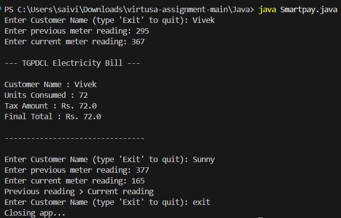
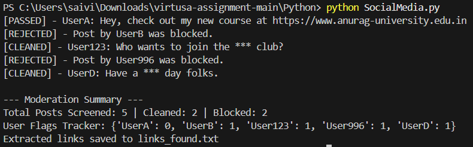
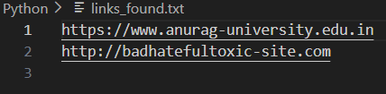
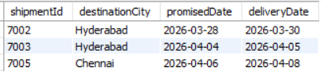
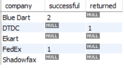
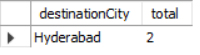
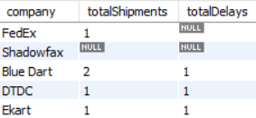

# Virtusa Assessment

## 1. Java Usecase - SmartPay Utility Biller

### Code Approach

```
Used an interface and implemented it to calculate the bill. Then used a simple if-else ladder to handle different unit ranges (0–100, 100–300, 300+). After calculating the amount, print the receipt with the customer details
```



## 2. Python Usecase - SocialMedia Content Sanitizer

### Code Approach

```
First, Split each post to separate the username and the post content. Then checking the content against the list of banned words using different approaches—like basic replace, manual searching with find(), and regex.

Once that’s done, tracking how many times each user gets flagged. At the same time determing whether the post is cleaned or blocked.

Also scanning the posts for any links and store them in a file. Finally, printing a summary showing how many posts were processed, cleaned, blocked, and how users were flagged.
```





## 3. SQL Usecase - E-Commerce Logistics Tracker

### Code Approach

#### Step 1: Database Schema Design

- **Partners Table** - Stores information about delivery companies like partnerId, email, and other company related info.
- **Shipments Table** - Records package delivery requests like shipmentId, destination city, package type, package weight etc.
- **DeliveryLogs Table** - Records actual delivery outcomes like rider details, delivery status etc.

#### Step 2: Key Queries

**Delayed Shipments:**

```
Compares actualDeliveryDate with promisedDate and if actualDeliveryDate > promisedDate then the delivery is marked as late.
```



**Performance Ranking:**

```
Used two separate group by queries to count successful and returned deliveries for each partner, and then joined them back with the partners table using LEFT JOIN to show each partner's record.
```



**Zone Filter:**

```
Getting the popular destination city by calculating the most number of orders placed in last 30 days.
```



**Partner Scorecard:**

```
Showing each partners total order shipments and the order delays they made, used two separate group by queries one for getting total shipments and another for getting total delays, then joined them back with the partners table using LEFT JOIN
```


